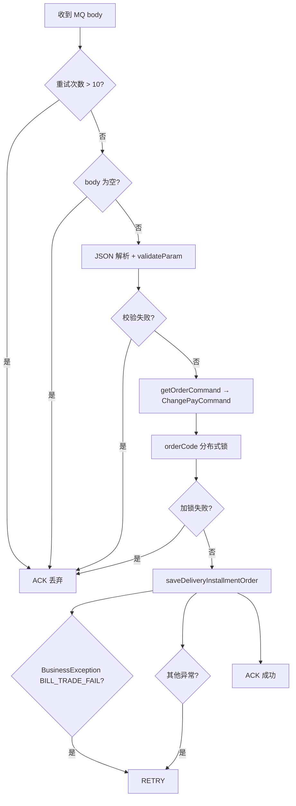

# 直投分期：变更结算（CHANGE_PAY）处理逻辑

本文档说明直投分期 **变更支付方式 / 支付方 / 收款主体** 的端到端流程，入口为 `DeliveryInstallmentOrderConsumer#consumer`，领域命令为 `DeliveryInstallmentChangePayCommand`。

与支付单、退货单的对比见 [delivery-installment-refund-flow.md](./delivery-installment-refund-flow.md)。

---

## 1. 业务含义

变更结算用于在**原分期订单仍在进行中**时，因以下任一维度发生变化而重新建单并接续剩余扣款计划：

| 变更维度 | 判断逻辑（`judgeChange`） |
|----------|---------------------------|
| 收款主体 | `financeBodyCode` 与原单不一致，或任一方为空 |
| 支付方式 | `payType` 与原单不一致（如中天 ↔ 兔网通） |
| 支付对象 | `orderObjectCode` 与原单不一致（网点/形象店等） |

若三者均未变化，校验失败：`付款方式和付款方均,收款主体无变更，无需处理`。

`operationType = 3`，对应 `OperationTypeEnum.CHANGE_PAY`（描述：变更支付方）。

---

## 2. 消息入口

### 2.1 Topic 与消费组

| 项 | 值 |
|----|-----|
| Topic | `tuxi_hst_delivery_installment_order_topic` |
| Consumer Group | `tuxi_hst_delivery_installment_order_consumer` |
| 消费类 | `settle/entry/.../DeliveryInstallmentOrderConsumer.java` |
| 顺序消费 | `isOrderly = true` |
| 线程数 | min/max = 32 |

### 2.2 `consumer` 方法处理流程



要点：

- **参数校验失败**、**超过最大重试**、**加锁失败（视为重复消息）**：均返回 `SUCCEED`，不再重试。
- **`ErrorCodeEnum.BILL_TRADE_FAIL`** 与一般 `Exception`：返回 `RETRY`。
- 锁 Key：`INSTALL_LOCK_KEY + orderCode`，自旋最长约 60s。

### 2.3 Command 路由

```java
// DeliveryInstallmentOrderConsumer#getOrderCommand
if (OperationTypeEnum.CHANGE_PAY.getCode().equals(createMq.getOperationType())) {
    return new DeliveryInstallmentChangePayCommand(createMq);
}
```

---

## 3. MQ 消息体 `DeliveryInstallmentOrderMq`

### 3.1 必填与放宽校验

`validateParam()` 对 `CHANGE_PAY` **提前 return**，仅校验：

- `orderCode`、`bizCode`、`payType`、`operationType`

**不要求**（与支付单不同）：`installmentMethod`、`yearPeriod`、`boxLeasePrice`、`orderDetailList` 等。变更单的业务数据主要从**原进行中分期单**回填。

### 3.2 变更场景建议携带的字段

| 字段 | 说明 |
|------|------|
| `orderCode` | 主单号（全生命周期不变） |
| `bizCode` | **新业务单号**（幂等键，须唯一） |
| `operationType` | `3` |
| `payType` | 新支付方式 |
| `paySiteCode` / `depotCode` | 决定新 `orderObjectCode` |
| `financeBodyCode` / `financeBodyName` | 新收款主体 |
| `accountType` | 付款对象类型（门店/老板等） |
| `carryFailedPeriods` | `Y`：剩余期数统计含 `PAY_FAIL`、`PAYING`；失败/支付中期备注「移至新订单」 |
| `closeFailedPeriods` | `Y`：关历史单时纳入 `PAY_FAIL`、`PAYING` 的支付计划 |
| `nextPlanDate` | 可选；写入收单 `OrderInstallmentRule.nextBeginDate` |
| `settleType` | `CELL_BILL`（按格口）或 `CYCLE_BILL`（按周期） |
| `cycleBillInfoList` | `CYCLE_BILL` 时**必须**有周期规则 |

非变更结算推送时，`carryFailedPeriods` / `closeFailedPeriods` 上游通常固定为 `N`。

### 3.3 示例（按格口计费变更支付方式）

```json
{
  "orderCode": "ORD20250527001",
  "bizCode": "ORD20250527001_CHG001",
  "businessTime": 1748323200000,
  "operationType": 3,
  "payType": 2,
  "paySiteCode": "73100",
  "depotCode": "KDCS19",
  "accountType": "KDCS",
  "financeBodyCode": "FB002",
  "financeBodyName": "新财务主体",
  "carryFailedPeriods": "Y",
  "closeFailedPeriods": "N",
  "settleType": "CELL_BILL"
}
```

---

## 4. 应用层编排

与支付/退货共用 `BizOrderAppServiceImpl#saveDeliveryInstallmentOrder`：

```text
validateParam → idptCheck → prepareData → calcAmount
→ queryHistoryOrder（事务外）
→ [事务] saveOrder → saveOrderDetail → dealHistoryOrder
→ sendOrderAfter（事务提交后）
```

| 步骤 | 变更结算特有行为 |
|------|------------------|
| `idptCheck` | 按**新** `bizCode` 幂等；已存在则 `BILL_EXISTS` |
| `prepareData` | 加载原进行中单；`judgeChange`；从原单复制明细与业务属性 |
| `calcAmount` | 按剩余待支付期重算金额（见 §5） |
| `queryHistoryOrder` / `dealHistoryOrder` | 关闭同 `orderCode` 下其它未完结分期及待支付计划 |
| `sendOrderAfter` | 发 `TUXI_HST_SETTLEMENT_RECEIVE_ORDER_TOPIC` 收单消息 |

---

## 5. 领域逻辑：`DeliveryInstallmentChangePayCommand`

源码：`settle/domain/.../DeliveryInstallmentChangePayCommand.java`。

### 5.1 `prepareData`

1. 按 `orderCode` + 当前 `bizCode` 查询**未完结**分期列表 `queryNotFinishByOrderCode`。
2. 必须恰好 **1 条**进行中单，取 `id` 最大者为 `sourceInstallmentOrder`。
3. 调用 `judgeChange()`，无实质变更则断言失败。
4. 若 `settleType = CYCLE_BILL`：断言 `cycleBillInfos` 非空。
5. `fillByDetailSourceOrder()`：从原单复制年限、分期方式、格口单价、合作商信息、**订单明细**（`creator = copyFrom`）等；`originalTotalPeriod` 兼容历史为 0 的场景。
6. 调用 `super.prepareData()` 补全门店名、一级组织等。

原单不存在时：`SOURCE_BILL_NOT_INVALID`。

### 5.2 `calcAmount`

#### 按格口计费（`CELL_BILL`，默认）

1. `buildUnFinishPayOrderQuery()` 统计**原单** `bizCode` 下待支付计划数 → `remainPeriod`。
2. `calcDayPeriod()`：
   - 月结：`remainPeriod × orderConfig.installmentLastMonthDay`
   - 日结：`remainPeriod`（天数）
3. `calculateNextPlanDate()`：取原单最早待支付计划的 `planDate` → `nextPlanDate`（可与 MQ 的 `nextPlanDate` 在 `buildOrderMessage` 中组合）。
4. 按剩余天数 × 格口单价重算每条明细 `cabinetRentPrice`、`amount`，汇总 `orderAmount`。
5. `populateBill`：`totalPeriod = remainPeriod`。

**`carryFailedPeriods = Y` 时**：待支付统计包含 `CREATE`、`PENDING_PAY`、`PAY_FAIL`、`PAYING`，且**不带** `lastPlanDate` 过滤。

**`carryFailedPeriods ≠ Y` 时**：仅 `CREATE`、`PENDING_PAY`，且 `lastPlanDate = now`。

#### 按周期计费（`CYCLE_BILL`）

- `orderAmount` = 各周期 `cycleFee` 之和（`DirectCycleBillInfo.calcTotalFee`）。
- 收单 `splitRule` 携带周期规则列表。

### 5.3 `buildOrderMessage`（收单规则）

| `settleType` | `splitRule` 内容 |
|--------------|------------------|
| `CYCLE_BILL` | `OrderInstallmentRule(settleType, installmentMethod, cycleBillInfos)` |
| `CELL_BILL` | `OrderInstallmentRule(yearPeriod, installmentMethod, remainPeriod, nextPlanDate, directType)` |

下游据此生成新的分期扣款计划。

### 5.4 历史单处理（基类 `dealHistoryOrder`）

对 `queryHistoryOrder` 查到的每条未完结历史分期：

1. 将其待支付 `HstPayOrder` 置为 `NO_PAY`。
2. 若 `carryFailedPeriods = Y` 且原状态为 `PAY_FAIL` / `PAYING`：`resultRemark = "移至新订单"`。
3. 历史分期单 `billStatus → CLOSED`，`remark` 含新 `bizCode`。
4. 异步发送 `INSTALLMENT_REFRESH_SUMMARY` 刷新汇总。

变更结算**不走**全量取消的 `INSTALLMENT_REFUND_AFTER` 后置 Topic（该路径仅 `DeliveryInstallmentCancelOrderCommand` 在无明细退货时使用）。

---

## 6. 与支付单、退货单对照

| 维度 | 支付 `PAY(1)` | 变更 `CHANGE_PAY(3)` | 退货有明细 `REFUND(2)` |
|------|---------------|----------------------|-------------------------|
| MQ 明细 | 必填 | 可不传（从原单复制） | 必填 |
| 原单 | 新建 | 必须存在且唯一进行中 | 必须存在 |
| 金额 | 全量按年/天/周期 | 剩余期待支付重算 | 仅 `PENDING_PAY` 驱动 |
| `carryFailedPeriods` | 通常 N | 常 Y（顺移失败期） | 通常 N |
| 后置 MQ | 收单 Topic | 收单 Topic | 收单 Topic |
| 全量取消后置 | — | — | 可能 `INSTALLMENT_REFUND_AFTER` |

---

## 7. 支付对象解析

`getOrderObjectCode()`（基类）：

| `payType` | 枚举 | `objectCode` 来源 |
|-----------|------|-------------------|
| 1 | `DirectPayTypeEnum.ZT_PAY` | `paySiteCode` |
| 2 | `DirectPayTypeEnum.TWT` | `depotCode` |

变更后 `orderObjectCode` 变化会触发 `judgeChange()` 为 true。

---

## 8. 异常与排查

| 现象 | 可能原因 |
|------|----------|
| 消费成功但无新单 | `judgeChange` 为 false；或参数校验失败被 ACK |
| `BILL_EXISTS` | 重复 `bizCode` |
| `进行中单号必须只有一条` | 同主单存在多条未完结分期 |
| `SOURCE_BILL_NOT_INVALID` | 无进行中原单 |
| `boxLeasePrice单价无效` | `DeliveryInstallmentOrderCommand#validateParam`（变更单在 `fillByDetailSourceOrder` 后应有原单价） |
| 持续 RETRY | `BILL_TRADE_FAIL` 或未知异常；查结算收单、钱包扣款链路 |
| 失败期未延续 | 检查 `carryFailedPeriods` 是否为 `Y` |

日志关键字：`变更支付方式单对应原单`、`收款主体变更`、`支付方式变更`、`支付对象变更`、`calcAmount orderAmount`。

---

## 9. 相关源码索引

| 说明 | 路径 |
|------|------|
| MQ 消费入口 | `settle/entry/.../DeliveryInstallmentOrderConsumer.java` |
| 变更命令 | `settle/domain/.../DeliveryInstallmentChangePayCommand.java` |
| 基类流程 | `settle/domain/.../DeliveryInstallmentOrderCommand.java` |
| MQ DTO | `settle/domain/.../DeliveryInstallmentOrderMq.java` |
| 应用编排 | `settle/application/.../BizOrderAppServiceImpl.java` |
| 操作类型枚举 | `common/common-beans/.../OperationTypeEnum.java` |
| 收单分期规则 | `settle/domain/.../OrderInstallmentRule.java` |
| 退换单总览 | [delivery-installment-refund-flow.md](./delivery-installment-refund-flow.md) |

---

## 8. 分期操作与可配置支付状态

`InstallmentOrder` 中取消/延期/暂停/提前支付等场景，通过 `OrderConfig#installmentOperablePayStatusMap`（Apollo：`order.installment-operable-pay-status-map`）按 `InstallmentPayOperateTypeEnum` 动态解析可操作 `pay_order` 状态，未配置时使用枚举内默认值。

| 操作类型 key | 对应方法 | 默认状态码 |
|--------------|----------|------------|
| `CANCEL` | `cancelPay` | 0, 1 |
| `DELAY` | `delayPay` | 0, 1 |
| `SUSPEND` | `suspendPay` | 0, 1 |
| `ADVANCE_PAY` | `advancePay`（查询） | 0, 1, -1, 2 |
| `UPDATE_FAIL_AND_PAYING` | `updateFailAndPaying`、`advancePay`（计划日前排序） | -1, 2 |

---

## 变更记录

| 日期 | 说明 |
|------|------|
| 2026-05-20 | 初版：基于 `DeliveryInstallmentOrderConsumer` 与 `DeliveryInstallmentChangePayCommand` 整理变更结算流程。 |
| 2026-05-20 | 补充分期操作 Apollo 可配置支付状态说明。 |

*文档版本：与仓库代码同步整理，变更请以代码为准。*
